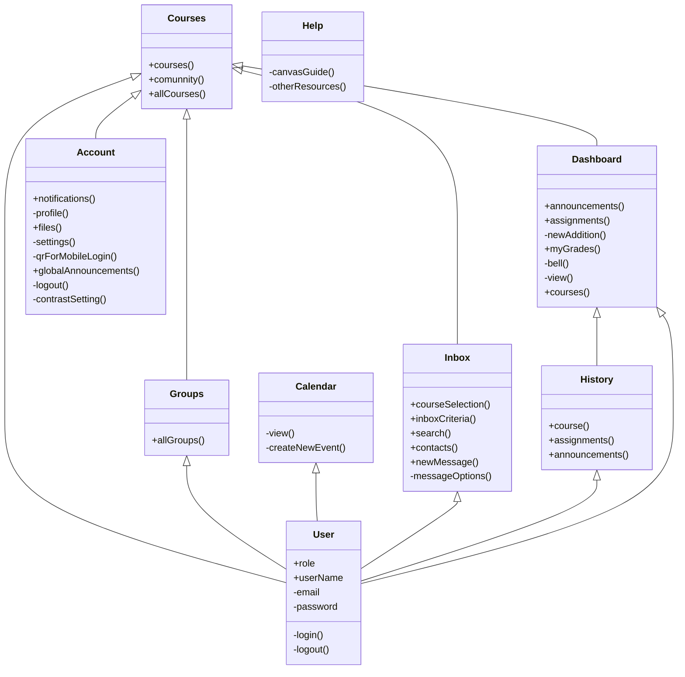

```mermaid

classDiagram

    Courses <|-- Dashboard
    Dashboard <|-- History
    Courses <|-- Inbox
    Courses <|-- Groups
    Courses <|-- Account
    Courses <|-- User
    Groups <|-- User
    Calendar <|-- User
    Inbox <|-- User
    History <|-- User
    Dashboard <|-- User


    class Dashboard {
        +announcements()
        +assignments()
        -newAddition()
        +myGrades()
        -bell()
        -view()
        +courses()

    }

    class Account {
        +notifications() 
        -profile()
        +files()
        -settings()
        -qrForMobileLogin()
        +globalAnnouncements()
        -logout()
        -contrastSetting()

    }

    class Courses {
        +courses()
        +comunnity()
        +allCourses()
    
    }

    class Groups {
        +allGroups()

    }

    class Calendar {
        -view()
        -createNewEvent()

    }

    class Inbox {
        +courseSelection()
        +inboxCriteria()
        +search()
        +contacts()
        +newMessage()
        -messageOptions()

    }

    class History {
        +course()
        +assignments()
        +announcements()

    }

    class Help {
        -canvasGuide()
        -otherResources()

    }

    class User {
        +role
        +userName
        -email
        -password
        -login()
        -logout()
    }

```